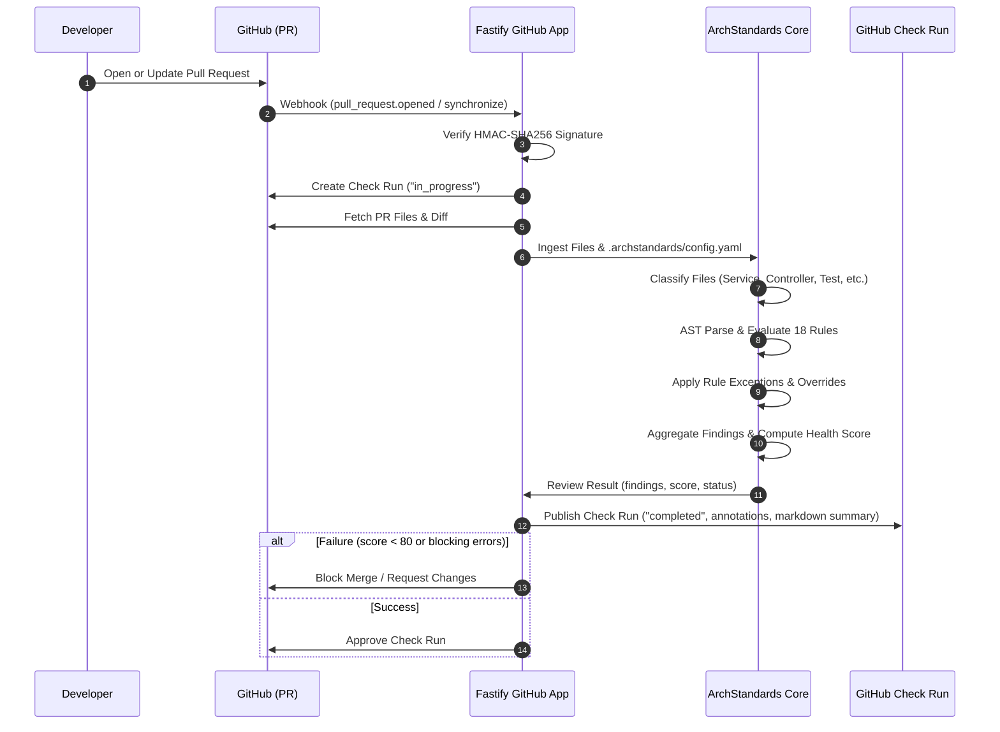

# How ArchStandards Works

ArchStandards operates as an automated architecture governance pipeline that turns versioned engineering standards into continuous feedback on GitHub pull requests.



---

## 1. Webhook Ingestion & Security

When a developer creates or pushes commits to a pull request, GitHub sends a `pull_request.opened` or `pull_request.synchronize` webhook event to the ArchStandards endpoint.

### Cryptographic Signature Verification
Every inbound payload is verified using HMAC-SHA256 over the raw request payload buffer using your configured `GITHUB_WEBHOOK_SECRET`:

```typescript
const hmac = crypto.createHmac("sha256", secret);
hmac.update(rawBody);
const expected = "sha256=" + hmac.digest("hex");
const isValid = crypto.timingSafeEqual(Buffer.from(signature), Buffer.from(expected));
```

Using `crypto.timingSafeEqual` prevents timing attacks, guaranteeing that unauthorized payloads cannot trigger compute cycles or spoof checks.

---

## 2. PR Context & File Classification

The GitHub Adapter uses Octokit authenticated as a GitHub App installation to retrieve the pull request metadata and changed files.

### File Heuristics & Classification
Each changed file is categorized into a `ReviewFile` model with:
- **Path & Name**: Normalized cross-platform path.
- **Language**: Determined by extension (`.ts`, `.js`, `.yaml`, `.json`).
- **File Type**: Categorized as `service`, `controller`, `repository`, `test`, `config`, or `model` based on directory structure and filename patterns:
  - `src/controllers/*.controller.ts` → `controller`
  - `src/services/*.service.ts` → `service`
  - `src/repositories/*.repository.ts` → `repository`
  - `tests/**/*.test.ts` → `test`
- **Content & Patch**: Raw file content and Git diff patch.

---

## 3. Configuration & Exception Matching

ArchStandards reads `.archstandards/config.yaml` from the repository root (or falls back to organization-level sensible defaults).

```yaml
version: "1"
standards:
  layering: strict
  maxControllerLines: 20
  minTestCoverage: 80
rules:
  ARCH-001: error
  API-001: warning
exceptions:
  - rule: "ARCH-001"
    path: "src/controllers/legacy-export.controller.ts"
    reason: "Scheduled for deprecation in Q3."
    expires: "2026-12-31"
```

### Exception Resolution
1. **Rule ID Matching**: Matches exact rule ID (e.g., `ARCH-001`).
2. **Glob Pattern Matching**: Evaluates path globs (e.g. `src/legacy/**`).
3. **Expiration Dates**: If an exception specifies an `expires` date and the current date exceeds it, the exception is invalidated automatically.

---

## 4. AST Analysis & Rule Engine Execution

The core rule engine executes rules against files in parallel. Unlike basic linters that only inspect single files in isolation, ArchStandards supports **holistic context**:

- **Single-File Rules**: For example, `ARCH-002` parses the TypeScript AST using the TypeScript Compiler API, extracting classes, methods, and line counts to detect bloated controllers.
- **Cross-Layer Import Rules**: `ARCH-001` extracts `import` statements and verifies that controllers do not import from `repositories/` or database clients.
- **Multi-File Context Rules**: `TEST-001` and `TEST-003` inspect `context.allFiles` to verify that newly created services have companion test files in the pull request.

---

## 5. Finding Aggregation & Architecture Health Scoring

Violations are collected into structured `Finding` objects. The engine calculates an overall **Architecture Health Score** (0 to 100):

```text
Score = Math.max(0, 100 - (errors * 15) - (warnings * 5) - (infos * 1))
```

### Decision Matrix

| Condition | Check Run Conclusion | Merge Status |
|---|---|---|
| Any `error` severity finding | `failure` | Blocked |
| Health Score < 80 | `failure` | Blocked |
| Only `warning` / `info` and Score ≥ 80 | `neutral` or `success` | Allowed with advisories |
| Zero findings (Score = 100) | `success` | Approved |

---

## 6. GitHub Check Run Publication

ArchStandards creates a comprehensive GitHub Check Run directly linked to the commit SHA:

1. **Inline Annotations**: Findings with exact line numbers are posted directly onto the GitHub PR Diff as native annotations with error messages, rationales, and suggestions.
2. **Markdown Summary**: A formatted summary table details the architecture score, total violations by severity, and rule breakdown.
3. **Educational Links**: Every violation links directly to the corresponding rule page in this documentation playbook, explaining *why* the standard exists and *how* to remediate it.
